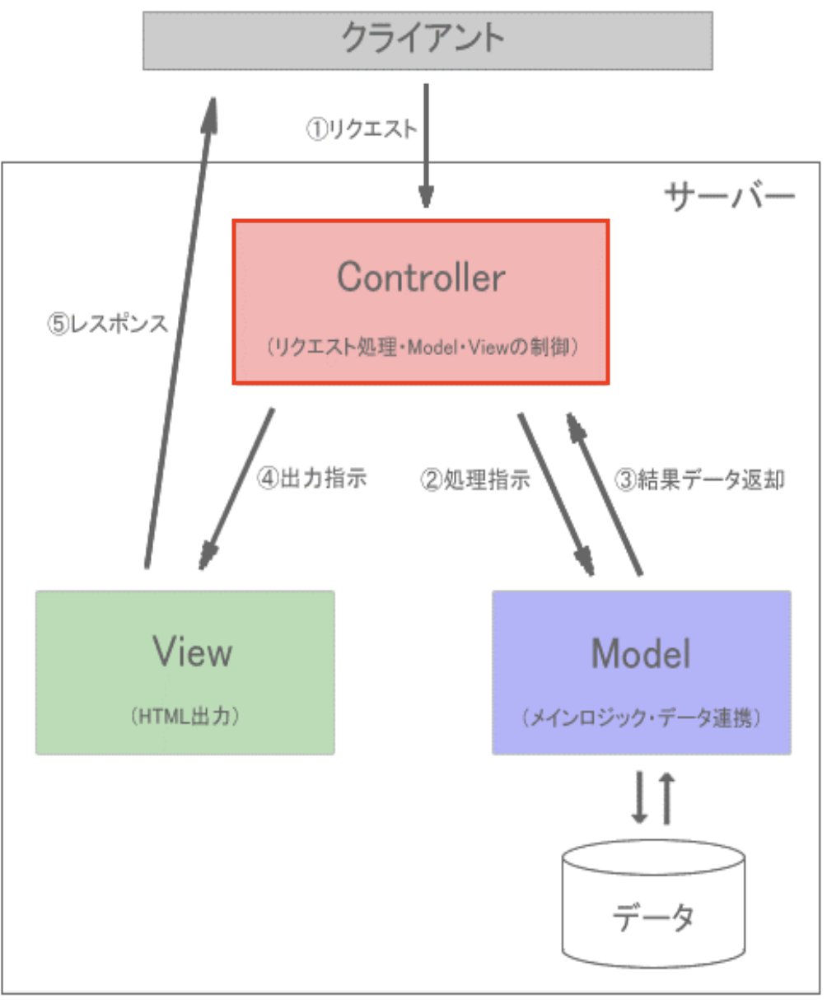

# コントローラについて

コントローラはMVCモデルで言うところの「C(Controller)」に相当します。
MVCモデルにおいて、コントローラは、クライアントからのリクエストを受け取り、リクエストに応じて、モデルからデータを取得したり、ビューに出力を指示したりと、いわゆる司令塔の役割を果たします。<br>


では、コントローラを作成しましょう。
手動でコントローラのPHPファイルも作成できますが、Laravelにはコマンドを使ってコントローラを作成する機能があります。

1. VSCode上で、`Ctrl+Shift+P`(Macの場合は`Cmd+Shift+P`)を押し、コンテナを起動する(既に起動している場合は不要)
2. VSCode上で、`Ctrl+J`(Macの場合は`Cmd+J`)を押し、ターミナルを表示する
3. 以下のコマンドを実行して、ItemControllerを作成する

```bash
php artisan make:controller ItemController
```

4. `app/Http/Controllers/ItemController.php` が作成されていることを確認する

5. 作成された`ItemController.php`をVSCodeで開き、以下のコードを追加する

    ```php
    <?php
    namespace App\Http\Controllers;

    use Illuminate\Http\Request;
    use App\Models\Item; // 追加

    class ItemController extends Controller
    {
        // --- 以下を追加 ---
        public function index()
        {
            $items = Item::all();
            return view('item.index', compact('items'));
        }
        // --- ここまで ---
    }
    ```

**【解説】**

`use App\Models\Item`: 先ほど[モデルについて]で作成した、`Item`モデルを使うために記述しています。
前期で習った`require_once`のようなもので、`items`テーブルとのやり取りを行うために、`Item`モデルを使いたいために記述しています。

`public function index`: <br>
Laravelでは、コントローラに記述する`index` メソッドは、「一覧表示画面を表示するためのメソッド名」として一般的に使われます。

`$items = Item::all();`: <br>
`Item::all()`は、`Item`モデルを使って、`items`テーブルの全データを取得するメソッドです。
`$items`には、`items`テーブルの全データが格納されます。

`return view('item.index', compact('items'));`: <br>

`view`メソッドは、ビューを表示するためのメソッドです。
第1引数には、表示するビューのファイル名を指定します。
第2引数には、ビューに渡すデータを連想配列で指定します。<br>
ここでは、`item.index`というビューに`$items`という変数を渡しています。
この`item.index`は、後ほど作成する`resources/views/item/index.blade.php`ファイルを指します。

**【補足】**<br>
このようにモデルを使ってデータベースからデータを取得する際、直接SQL文を書くことなく、モデルのメソッドを使ってデータベースとのやり取りを行うことができます。
これは、Laravelの**Eloquent ORM(エロクアント ORM)**という機能で、モデルを使ってデータベースとのやり取りを行う際に、SQL文を書かずにデータベースとのやり取りを行うことができます。