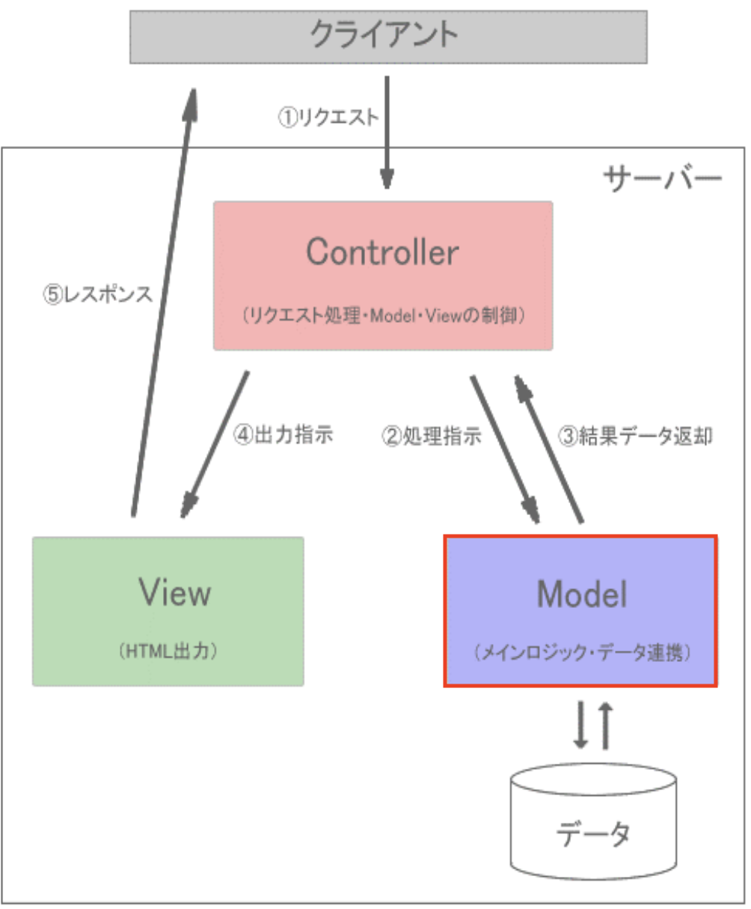

# モデルについて

モデルはMVCモデルで言うところの「M(Model)」に相当します。
MVCモデルにおいて、モデルはデータベースとのやり取りを担当します。<br>


では、モデルを作成しましょう。
手動でモデルのPHPファイルも作成できますが、Laravelにはコマンドを使ってモデルを作成する機能があります。

1. VSCode上で、`Ctrl+Shift+P`(Macの場合は`Cmd+Shift+P`)を押し、コンテナを起動する(既に起動している場合は不要)
2. VSCode上で、`Ctrl+J`(Macの場合は`Cmd+J`)を押し、ターミナルを表示する
3. 以下のコマンドを実行して、Itemモデルを作成する

```bash
php artisan make:model Item
```

4. app/Models/Item.php が作成されていることを確認する
5. 以下のようにItem.phpを修正する

    ```php
    <?php
    namespace App\Models;

    use Illuminate\Database\Eloquent\Factories\HasFactory;
    use Illuminate\Database\Eloquent\Model;

    class Item extends Model
    {
        use HasFactory;

        // 以下を追加
        protected $primaryKey = 'ident';
    }
    ```

**【解説】**　<br>

`protected $primaryKey = 'ident';`: <br>
[マイグレーションの補足](migration.md#マイグレーション)で説明したように、`items`テーブルの主キーがデフォルトの`id`ではなく`ident`であるため、`$primaryKey`プロパティを使って、主キーが`ident`であることを指定しています。
この指定がなければ、モデルを使用してデータを取得する際、`id`を主キーとして扱おうとしてしまいエラーが発生します。

上記のように、`php artisan make:model Item`コマンドを実行し、Itemモデルを作成することで、`items`テーブルとのやり取りを行うための準備ができました。

**【補足】**　<br>
Laravelにおいて、「モデル名」と「テーブル名」には命名規則があります。
それは、原則、**「モデル名」は「テーブル名」の単数系でなければならない！**ということです。
(例: 「Item」モデル と「item**s**テーブル」)

ですので、Laravelではこの命名規則に則り構造化されているので、これを破るとエラーがでます。
とはいうものの、この命名規則に則っていないコードも出てきたりするので、そう言った場合の対処法もあるのでご安心を。
とりあえずはこの命名規則に則っていない場合は、なんらかの対処が必要だと頭の片隅にでも置いておいてください。

では、次にコントローラを使って、`items`テーブルからデータを取得し、ビューに渡す処理を行います。