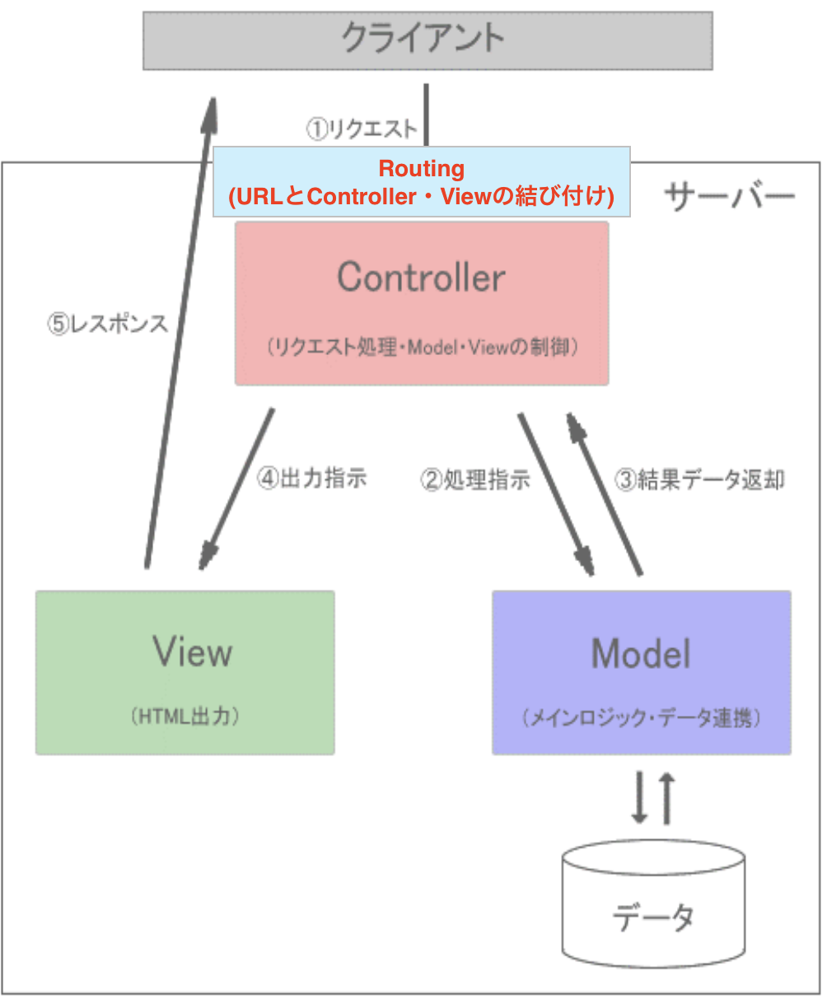

# ルーティングの作成

それでは、先ほど作成したコントローラを使って、商品データを取得し、ビューに渡すためのルーティングとビューを作成していきます。
ルーティングとビューが作成できれば、ブラウザで商品データが表示されるようになります。

まずはクライアントからリクエストがサーバーに送信された際に、必要に応じてマッピングを行う必要があります。(※マッピングとは、特定のURLにアクセスしたときにどのビューやコントローラを呼び出すかを定義することです。)

その役目を担うのがルーティングでしたね。
では、`routes/web.php`ファイルにルーティングを設定しましょう。

今回は、`ItemController`の`index`メソッドを呼び出すためのルーティングを設定します。

```php
use Illuminate\Support\Facades\Route;
use App\Http\Controllers\ItemController; // 追加

// 途中省略

// 以下を追加
Route::get('item', [ItemController::class, 'index'])->name('item.index');
```

**【解説】**

`use App\Http\Controllers\ItemController;`: <br>
`ItemController`クラスを使用するために、`ItemController`クラスを読み込んでいます。

`Route::get('item', [ItemController::class, 'index']);`: <br>
`Route::get`メソッドは、`GET`リクエストを受け取った際に、指定したコントローラの指定したメソッドを呼び出すためのルーティングを設定します。
第1引数には、URLを指定します。ここでは、`item`というURLにリクエストが送信された際に、`ItemController`クラスの`index`メソッドを呼び出すように設定しています。

`[ItemController::class, 'index']`は、`ItemController`クラスの`index`メソッドを呼び出すことを示しています。

**【補足】**<br>
勘の良い方は気づいたかもしれませんが、Laravelではリクエストからコントローラまでの経路をルーティングで定義します。
ですので、以下の図で示すと、リクエストとコントローラの間にルーティングが挟まっているイメージです。

