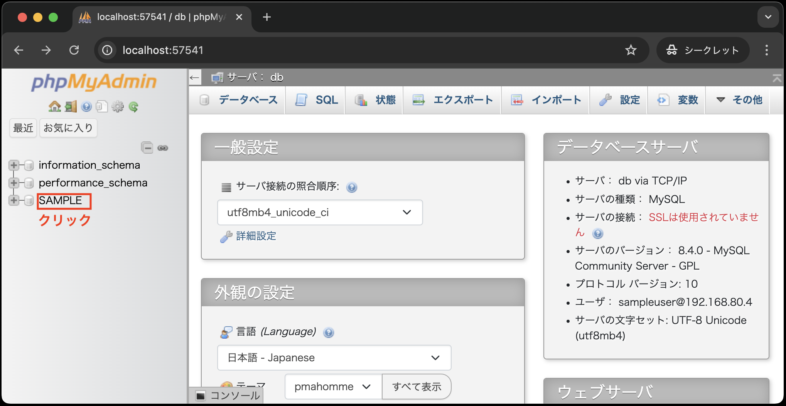
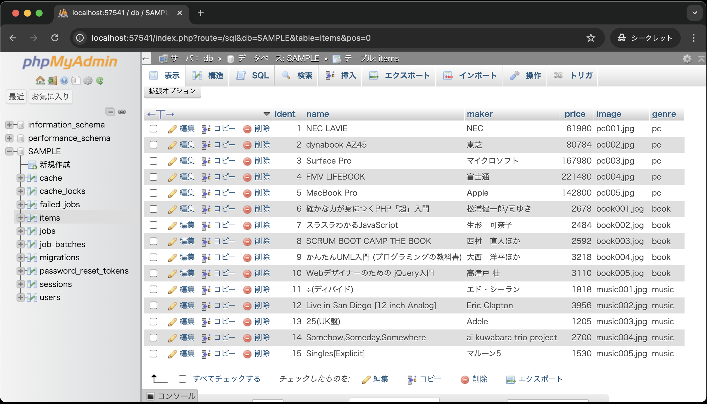

# シーダー

シーダーとは、データベースに初期データを挿入するための仕組みです。
シーダーを使うことで、データベースのテストデータや初期データを簡単に挿入することができます。

では、シーダーを使って、`items`テーブルにデータを挿入しましょう。

1. VSCode上で、`Ctrl+Shift+P`(Macの場合は`Cmd+Shift+P`)を押し、コンテナを起動する(既に起動しているなら不要)
2. VSCode上で、`Ctrl+J`(Macの場合は`Cmd+J`)を押し、ターミナルを表示する
3. 以下のコマンドを実行して、ItemTableSeederを作成する

```bash
php artisan make:seeder ItemTableSeeder
```

4. `database/seeders/ItemTableSeeder.php` が作成されていることを確認する
5. 以下のようにシーダーを修正する

    ```php
    <?php

    namespace Database\Seeders;

    use Illuminate\Database\Console\Seeds\WithoutModelEvents;
    use Illuminate\Database\Seeder;
    use Illuminate\Support\Facades\DB; // 追加(忘れずに！)

    class ItemTableSeeder extends Seeder
    {
        /**
        * Run the database seeds.
        */
        public function run()
        {
            // --- 以下を追加 ---
            DB::table('items')->insert([
                ['ident' => 1, 'name' => 'NEC LAVIE', 'maker' => 'NEC', 'price' => 61980, 'image' => 'pc001.jpg', 'genre' => 'pc'],
                ['ident' => 2, 'name' => 'dynabook AZ45', 'maker' => '東芝', 'price' => 80784, 'image' => 'pc002.jpg', 'genre' => 'pc'],
                ['ident' => 3, 'name' => 'Surface Pro', 'maker' => 'マイクロソフト', 'price' => 167980, 'image' => 'pc003.jpg', 'genre' => 'pc'],
                ['ident' => 4, 'name' => 'FMV LIFEBOOK', 'maker' => '富士通', 'price' => 221480, 'image' => 'pc004.jpg', 'genre' => 'pc'],
                ['ident' => 5, 'name' => 'MacBook Pro', 'maker' => 'Apple', 'price' => 142800, 'image' => 'pc005.jpg', 'genre' => 'pc'],
                ['ident' => 6, 'name' => '確かな力が身につくPHP「超」入門', 'maker' => '松浦健一郎/司ゆき', 'price' => 2678, 'image' => 'book001.jpg', 'genre' => 'book'],
                ['ident' => 7, 'name' => 'スラスラわかるJavaScript', 'maker' => '生形　可奈子', 'price' => 2484, 'image' => 'book002.jpg', 'genre' => 'book'],
                ['ident' => 8, 'name' => 'SCRUM BOOT CAMP THE BOOK', 'maker' => '西村　直人ほか', 'price' => 2592, 'image' => 'book003.jpg', 'genre' => 'book'],
                ['ident' => 9, 'name' => 'かんたんUML入門 (プログラミングの教科書)', 'maker' => '大西　洋平ほか', 'price' => 3218, 'image' => 'book004.jpg', 'genre' => 'book'],
                ['ident' => 10, 'name' => 'Webデザイナーのための jQuery入門', 'maker' => '高津戸 壮', 'price' => 3110, 'image' => 'book005.jpg', 'genre' => 'book'],
                ['ident' => 11, 'name' => '÷(ディバイド)', 'maker' => 'エド・シーラン', 'price' => 1818, 'image' => 'music001.jpg', 'genre' => 'music'],
                ['ident' => 12, 'name' => 'Live in San Diego [12 inch Analog]', 'maker' => 'Eric Clapton', 'price' => 3956, 'image' => 'music002.jpg', 'genre' => 'music'],
                ['ident' => 13, 'name' => '25(UK盤)', 'maker' => 'Adele', 'price' => 1205, 'image' => 'music003.jpg', 'genre' => 'music'],
                ['ident' => 14, 'name' => 'Somehow,Someday,Somewhere', 'maker' => 'ai kuwabara trio project', 'price' => 2700, 'image' => 'music004.jpg', 'genre' => 'music'],
                ['ident' => 15, 'name' => 'Singles[Explicit]', 'maker' => 'マルーン5', 'price' => 1530, 'image' => 'music005.jpg', 'genre' => 'music'],
            ]);
            // --- ここまで ---
        }
    }
    ```

    **【解説】**
    
    `namespace...`: <br>
    `namespace`とは、クラスをグループ化するためのキーワードです。
    ここでは、`Database\Seeders`という名前空間に`ItemTableSeeder`クラスを定義しています。
    名前空間を使うことで、同じクラス名でも異なる名前空間に属するクラスを区別することができます。

    `DB::table('items')->insert`: <br>
    連想配列を使って、`items`テーブルにデータを挿入します。

6. `database/seeders/DatabaseSeeder.php` を以下のように修正する

    ```php
    <?php

    namespace Database\Seeders;

    use Illuminate\Database\Seeder;

    class DatabaseSeeder extends Seeder
    {
        /**
        * Seed the application's database.
        */
        public function run()
        {
            // --- 以下を追加 ---
            $this->call(ItemTableSeeder::class);
            // --- ここまで ---

            // デフォルトはコメントアウト
            // User::factory(10)->create();

            // User::factory()->create([
            //     'name' => 'Test User',
            //     'email' => 'test@example.com',
            // ]);
        }
    }
    ```

    **【解説】**

    `$this->call(ItemTableSeeder::class);`: <br>
    `ItemTableSeeder`クラスを呼び出して、データベースにデータを挿入します。
    以下の`php artisan db:seed`コマンドを実行することで、`DatabaseSeeder`クラスの`run`メソッドが実行され、`ItemTableSeeder`クラスが呼び出されます。

7. 以下のコマンドを実行して、シーダーを実行する

    ```bash
    php artisan db:seed
    ```

以上で、`items`テーブルにデータが挿入されました。

## phpMyAdminでのデータ確認

「`.env`ファイルの編集」、「マイグレーション」、「シーダー」の手順を踏んだ後、phpMyAdminでデータが正しく挿入されたか確認しましょう。

1. VSCode上で、`Ctrl+Shift+P`(Macの場合は`Cmd+Shift+P`)を押し、コンテナを起動する(既に起動している場合は不要)
2. VSCode上で、`Ctrl+J`(Macの場合は`Cmd+J`)を押し、ポートをクリックする
3. 画面下部のポートから「phpmyadmin:80」の地球儀マークをクリックする<br>
   
4. 以下の手順により、`items`テーブルにデータが挿入されているか確認する
   
   
   

    **【補足】**<br>
    ※画像を見ると、`items`テーブル以外にも、いくつかのテーブルが作成されていることがわかりますが、これらはLaravelのデフォルトで作成されるテーブルです。
    database/migrationsディレクトリには、これらのテーブルを作成するためのマイグレーションファイルがデフォルトで用意されており、`php artisan migrate`コマンドを実行することで、これらのテーブルが作成されました。

以上で、データベースの準備が整いました。
次はデータベースのやり取りを担当するモデルについて学びます。