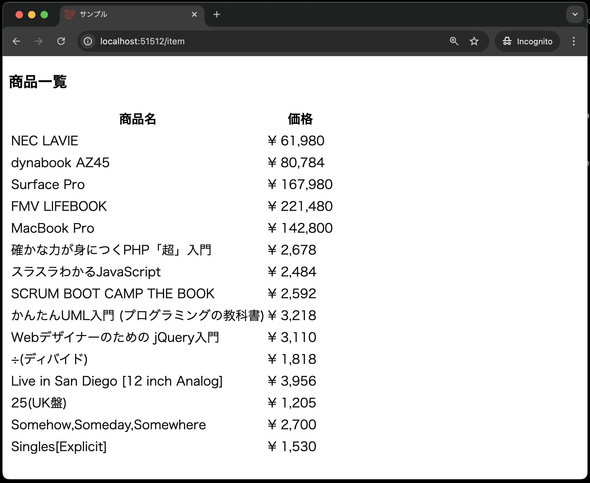

# ビューの作成

次に、商品データを表示するためのビューを作成します。

まず、`resources/views`ディレクトリに`item`ディレクトリを作成し、その中に`index.blade.php`ファイルを作成します。
※先ほどの`ItemController`の`index`メソッドで`return view('item.index', compact('items'));`としているため、`item`ディレクトリに`index.blade.php`ファイルを作成する必要があります。
※`item`ディレクトリ並びに`index.blade.php`ファイルは、コマンドではなく手動で作成してください。


```php
<!DOCTYPE html>
<html lang="ja">
<head>
<meta charset="UTF-8">
<meta name="viewport" content="width=device-width, initial-scale=1.0">
<title>サンプル</title>
</head>
<body>
<h3>商品一覧</h3>
    <table>
        <tr>
            <th>商品名</th>
            <th>価格</th>
        </tr>
    @foreach( $items  as  $item )
        <tr>
            <td> {{  $item->name }} </td>
            <td>&yen; {{  number_format( $item->price) }} </td>
        </tr>
    @endforeach
    </table>
</body>
</html>
```


**【解説】**

`$items`: <br>
`$items`は、`ItemController`の`index`メソッドで取得した商品データが入っています。
ルーティングで、`return view('item.index', ['items' => $items]);`として、`$items`をビューに渡しているため、ビュー内で`$items`を使うことができます。

`@foreach( $items  as  $item )`: <br>
`@foreachディレクティブ`は、PHPのforeach文と同じ使い方ができるディレクティブであり、`@endforeach`ディレクティブで終了します。
`$items`には、商品データが入っています。
`$items`のデータを1つずつ取り出して、`$item`に代入しています。


`{{ $item->name }}`、`{{  number_format( $item->price) }}`: <br>
Laravelには、ビューで変数を表示したり、関数を呼び出したりする`{{  }}`という構文があります。

今回は、変数を表示する際に使用しています。
`$item->name`、`$item->price`は、商品データの各カラムの値を取得しています。

**【補足({{  }}のセキュリティについて)】**

Bladeテンプレートでは、`{{  }}`で囲まれた部分にPHPのコードを埋め込むことができます。
実は、`{{  }}`で囲まれた部分は、エスケープされるため、XSS(クロスサイトスクリプティング)攻撃を防ぐことができます。

PHPでは、エスケープ処理を実装するには、`htmlspecialchars`関数を使っていましたが、、Bladeテンプレートでは、`{{  }}`で囲むだけでエスケープ処理が自動で行われるため、セキュリティ対策が簡単に行えます。


## 動作確認

これで、クライアントからリクエストを送信すると、商品一覧が表示されるようになりました。

では、実際に動作確認を行いましょう。

1. VSCode上で、`Ctrl+Shift+P`(Macの場合は`Cmd+Shift+P`)を押し、コンテナを起動する(既に起動しているなら不要)
2. VSCode上で、`Ctrl+J`(Macの場合は`Cmd+J`)を押し、画面下部のポートをクリックし、「web:80」の地球儀マークをクリックする<br>
   
3. ブラウザのアドレスバーの末尾に`/item`を追加し、Enterキーを押す
4. 商品一覧が表示されればOK<br>
    
